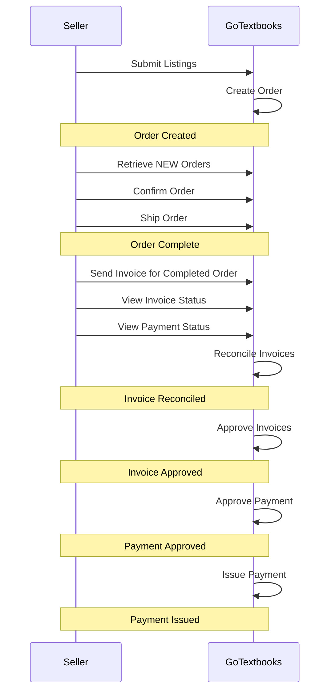
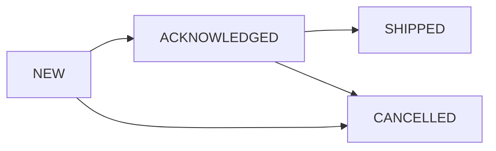
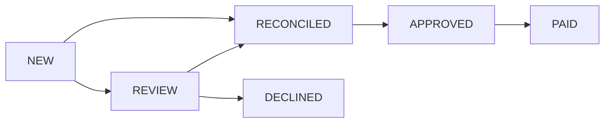
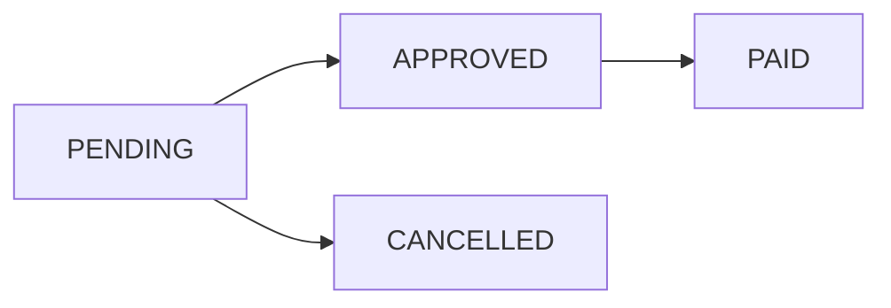

# CDF Integration API

GoTextbooks provides an API with the following endpoints to support listing, purchasing and invoicing. The API endpoints 
use JSON and [JSONL](https://jsonlines.org) formatted requests and responses. An API access key will be provided
to both a test system and the live system.

Each API request is logged and identified using the X-Request-ID header sent as a UUID. Please log all requests
with the request UUID so they can be provided when investigating issues or questions.

## Concepts

### System Interaction


<div style="page-break-after: always;"></div>

### Listings
Listings are the quantity and price for a particular product available in a given condition at a particular location.
GoTextbooks uses the quantity provided in a listing as the baseline and offsets pending and confirmed order quantities
to track the current inventory levels. When a listing is updated, GoTextbooks resets the offset to only include
unconfirmed order quantities.

### Orders
Orders are a request to purchase one or more items and ship them to an end customer.

| Status       | Description                                                                                  |
|--------------|----------------------------------------------------------------------------------------------|
| NEW          | Orders begin in NEW status. NEW orders are assumed to have not yet been observed by seller.  |
| ACKNOWLEDGED | Acknowledged orders are confirmed for fulfillment at the price indicated in the order.       |
| SHIPPED      | Order has been sent to the end customer.                                                     |
| CANCELLED    | Order has been cancelled by seller or by GoTextbooks                                         |

Order and Item LifeCycle

The order status reflects the status of the item with the least amount of progression through the lifecycle. 

* NEW - at least one item is in NEW status
* ACKNOWLEDGED - no items in NEW status and at least one item in ACKNOWLEDGED status
* SHIPPED - no items in NEW or ACKNOWLEDGED status and at least one item in SHIPPED status
* CANCELLED - all items in CANCELLED status
 



<div style="page-break-after: always;"></div>

### Invoices
Invoices are requests by the seller for payment. One invoice per shipped order should be submitted after the 
order has been shipped. The invoice is used for reconciliation against orders so any price or payment disparities
can be resolved prior to payment issuance.

| Status     | Description                                                                            |
|------------|----------------------------------------------------------------------------------------|
| NEW        | Invoices begin in NEW status. NEW invoices have not yet been processed by GoTextbooks. |
| REVIEW     | Invoice requires manual review.                                                        |
| RECONCILED | Invoice has passed automatic or manual review.                                         |
| APPROVED   | Invoice has been approved for payment but has not yet been paid.                       |
| PAID       | Invoice has been paid.                                                                 |
| DECLINED   | Invoice was not approved and will not be paid.                                         |

Invoice LifeCycle


### Payments
Payments are issued when one or more invoices are APPROVED within a payment cycle. 

| Status    | Description                                                                                                      |
|-----------|------------------------------------------------------------------------------------------------------------------|
| PENDING   | Payments begin in PENDING status. A payment will remain in PENDING until the payment cycle.                      |
| APPROVED  | Payment has been approved and no further invoices will be added to it.                                           |
| PAID      | Payment has been issued to seller.                                                                               |
| CANCELLED | Payment has been cancelled and will not be issued. Any unpaid approved invoices will be linked to a new payment. |

Payment LifeCycle


### Locations
A Location is a place from which orders may be fulfilled. Locations must be registered with GoTextbooks before listings 
can be created.

### 

## Common Request Headers
| Name          | Type   | Example                                      |                             |
|---------------|--------|----------------------------------------------|-----------------------------|
| Content-Type  | string | application/json or application/jsonl+json   | only JSON/JSONL supported   |
| Authorization | string | Token token=Z8Ceb4ghz2Qewu5RKZRaXSTKvCgCnHqM | API token                   |
| X-Request-ID  | UUID   | 83c2624f-fe62-4e37-a176-fadd510422d2         | Unique per Request+Response |

<div style="page-break-after: always;"></div>

## GET /api/v1/sellers/{seller-code}/listings
Retrieve current listings. Max 1000 per page.

### Request Parameters
| Name     | Type    |                                                         | Required  |
|----------|---------|---------------------------------------------------------|-----------|
| page     | integer | Page to retrieve. Default value is 1                    | Optional  |
| per_page | integer | Number of results to return. Default 100, Maximum 1000. | Optional  |

```json
{
  "listings_count": 2,
  "listings": [
    {
      "product_code": "978XXXXXXXXXXXX",
      "condition": "NEW",
      "quantity": 10,
      "price": 82.49,
      "location_id": 1
    },
    {
      "product_code": "978XXXXXXXXXXXX",
      "condition": "USED",
      "quantity": 10,
      "price": 42.49,
      "location_id": 1
    }
  ]
}
```

## PUT /api/v1/sellers/{seller-code}/listings/{product_code}

Create or fully update the listing for `{product_code}`. The `{product_code}` must be present in the 
catalog or the request will be rejected.

### Body
| Name         | Type    |                                         | Required  |
|--------------|---------|-----------------------------------------|-----------|
| product_code | string  | EAN of the product                      | Mandatory |
| condition    | string  | Condition of the product - NEW or USED  | Mandatory |
| quantity     | Integer | Current quantity available for purchase | Mandatory |
| price        | Money   | Current price                           | Mandatory |
| location_id  | Integer | Location Identifier                     | Mandatory |


```json
{ 
  "product_code": "978XXXXXXXXXXXX",
  "condition": "USED", 
  "quantity": 10, 
  "price": 42.49,
  "location_id": 1
}
```

### Response

#### New Listing Accepted
Status: 201
```json
{ 
  "product_code": "978XXXXXXXXXXXX",
  "condition": "USED", 
  "quantity": 10, 
  "price": 42.49,
  "location_id": 1
}
```

#### Existing Listing Updated
Status: 200
```json
{ 
  "product_code": "978XXXXXXXXXXXX",
  "condition": "USED", 
  "quantity": 10, 
  "price": 42.49,
  "location_id": 1
}
```

#### Bad Request
Status: 400

Do not retry, the request was not sufficient for processing and needs to be altered before submitting again.

Body:
```json
{
    "message": "error message"
}
```

#### Missing or Empty Required Param
Status: 422

Do not retry, the request was not sufficient for processing and needs to be altered before submitting again.

Body:

```json
{
    "condition": ["can't be blank"]
}
```

#### Internal Server Error
Status: 5xx

Will attempt to provide a JSON response compatible with 4xx responses but may not always be viable.
Requests should be retried on the assumption it was a temporary availability issue.
Consistent 5xx responses for an individual listing would need to be manually reviewed.

## GET /api/v1/sellers/{seller-code}/listings/{product_code}/{condition}/{location}
Retrieves the current listing for `{product_code}`.

The `{condition}` and `{location}` path parameters are optional and can be omitted. If not provided the system defaults
to `used` and the default location for the seller.

```json
{
  "product_code": "978XXXXXXXXXXXX",
  "condition": "USED",
  "quantity": 10,
  "price": 42.49,
  "location_id": 1
}
```

## DELETE /api/v1/sellers/seller-code}/listings/{product_code}/{condition}/{location}
Removes the listing for `{product_code}`. Existing unconfirmed orders will still be assumed to be fulfilled
and must be either confirmed or canceled via the normal process using the `orders` endpoint.

The `{condition}` and `{location}` path parameters are optional and can be omitted. If not provided the system defaults
to `used` and the default location for the seller.

## POST /api/v1/sellers/{seller-code}/listings
Create or fully update one or more listings. Max 100 listings in any request. All listing changes or additions
will be rejected if any errors are encountered.

```json
{
  "listings": [
    {
      "product_code": "978XXXXXXXXXXXX",
      "condition": "NEW",
      "quantity": 10,
      "price": 82.49,
      "location_id": 1
    },
    {
      "product_code": "978XXXXXXXXXXXX",
      "condition": "USED",
      "quantity": 10,
      "price": 42.49,
      "location_id": 1
    }
  ]
}
```

#### All Listings Accepted
Status: 200


#### Bad Request
Status: 400

Do not retry, the request was not sufficient for processing and needs to be altered before submitting again.

Body:
```json
{
    "message": "error message"
}
```

#### Missing or Empty Required Param
Status: 422

Do not retry, the request was not sufficient for processing and needs to be altered before submitting again. Error message
response will only pertain to the first listing that could not be processed, the rest will be discarded.

Body:

```json
{
    "condition": ["can't be blank"]
}
```

#### Internal Server Error
Status: 5xx

Will attempt to provide a JSON response compatible with 4xx responses but may not always be viable.
Requests should be retried on the assumption it was a temporary availability issue.
Consistent 5xx responses for an individual listing would need to be manually reviewed.

## POST /api/v1/sellers/{seller-code}/feeds/{feed-type}

Supported feed types:
* full - `/api/v1/sellers/{seller-code}/feeds/full`
* delta - `/api/v1/sellers/{seller-code}/feeds/delta`

Create a bulk feed for processing. Feeds are processed asynchronously. Feeds are processed in the order in which they 
are received. Lines within the feed may be processed in parallel. The feed is not checked for uniqueness. If two lines
in the feed are for the same product and have different values there is no guarantee which will be processed last.
The feed is not checked for asynchronous updates using the single listing update API. If utilizing both API endpoints
the seller is responsible for coordinating the sequence. GoTextbooks recommends not using the single listing API update
while any feed is pending or in process.

Feeds are formatted in JSONL.

### Per Line Fields
| Name         | Type    |                                         | Required  |
|--------------|---------|-----------------------------------------|-----------|
| product_code | string  | EAN of the product                      | Mandatory |
| condition    | string  | Condition of the product - NEW or USED  | Mandatory |
| quantity     | Integer | Current quantity available for purchase | Mandatory |
| price        | Money   | Current price                           | Mandatory |
| location_id  | Integer | Location Identifier                     | Mandatory |

```json lines
{ "product_code": "978XXXXXXXXXXXX","condition": "USED", "location_id": 1, "quantity": 10, "price": 42.49 }
{ "product_code": "978XXXXXXXXXXXX","condition": "NEW",  "location_id": 1, "quantity": 16, "price": 79.99 }
```

## GET /api/v1/sellers/{seller-code}/feeds
Lists all feeds present in the system and their status.

```json
{
  "feeds": [
    { "id": 75, "feed_type": "listings-delta", "status":  "pending",    "total_records": 0,      "issue_count": 0, "created_at":  "2022-09-01T04:37:18.000Z", "processed_at":  null},
    { "id": 75, "feed_type": "listings-delta", "status":  "processing", "total_records": 0,      "issue_count": 0, "created_at":  "2022-09-01T04:37:18.000Z", "processed_at":  null},
    { "id": 22, "feed_type": "listings-delta", "status":  "processed",  "total_records": 123058, "issue_count": 3, "created_at":  "2022-08-29T02:00:00.000Z", "processed_at":  "2022-08-29T02:00:00.000Z"},
    { "id": 18, "feed_type": "listings-delta", "status":  "cancelled",  "total_records": 0,      "issue_count": 0, "created_at":  "2022-08-26T02:00:00.000Z", "processed_at":  null},
    { "id": 14, "feed_type": "listings-delta", "status":  "processed",  "total_records": 123058, "issue_count": 0, "created_at":  "2022-08-23T02:00:00.000Z", "processed_at":  "2022-08-23T02:00:00.000Z"},
    { "id": 10, "feed_type": "listings-full",  "status":  "processed",  "total_records": 186153, "issue_count": 0, "created_at":  "2022-08-20T02:00:00.000Z", "processed_at":  "2022-08-20T02:00:00.000Z"}
  ]
}
```

## GET /api/v1/sellers/{seller-code}/feeds/{feed-id}
Details of a specific feed in the system.

```json
{ 
  "id": 75, 
  "feed_type": "delta", 
  "status": "pending",   
  "total_records": 0,      
  "issue_count": 0, 
  "created_at": "2022-09-01T04:37:18.000Z",
  "processed_at": null
}
```

## GET /api/v1/sellers/{seller-code}/feeds/{feed-id}/content
Returns the feed content submitted for `{feed_id}`.

```json lines
{ "product_code": "978XXXXXXXXXXXX","condition": "USED", "location_id": 1, "quantity": 10, "price": 42.49 }
{ "product_code": "978XXXXXXXXXXXX","condition": "NEW",  "location_id": 1, "quantity": 16, "price": 79.99 }
```

## GET /api/v1/sellers/{seller-code}/feeds/{feed-id}/audit
Returns the lines of the feed that could not be processed.

## DELETE /api/v1/sellers/{seller-code}/feeds/{feed-id}
Cancel a pending feed. Completed and in process feeds cannot be canceled and a 4xx will be returned.

<div style="page-break-after: always;"></div>

## GET /api/v1/sellers/{seller-code}/orders
Returns orders allocated to seller.

### Request Parameters
| Name     | Type    |                                                                            | Required  |
|----------|---------|----------------------------------------------------------------------------|-----------|
| status   | string  | Filter orders by status. "new", "acknowledged", "shipped", "cancelled".    | Optional  |
| order    | string  | Sort order by creation timestamp. "asc" or "desc". Default value is 'desc' | Optional  |
| page     | integer | Page to retrieve. Default value is 1                                       | Optional  |
| per_page | integer | Number of results to return. Default 100, Maximum 1000.                    | Optional  |

```
{
  "orders_count": 123,
  "orders": [
    {
      "uuid": "order_uuid_1",
      "order_key": "order_key_1",
      "order_date": "2022-09-01 20:30:50",
      "status": "new",
      "ship_method": "std",
      "customer_info": {
        "first_name": "first_name",
        "last_name": "last_name",
        "address_line1": "address_line1",
        "address_line2": "address_line2",
        "city": "city",
        "state": "state",
        "postal_code": "postal_code",
        "country": "country",
        "phone_number": "phone_number"
      },
      "line_items": [
        {
          "item_uuid": "item_uuid_1_1",
          "status": "new",
          "condition": "USED",
          "product_code": "1111111111111",
          "price": 19.99,
          "location_id": "1"
          "tracking_number": null
        }
      ]
    },
    {
      "uuid": "order_uuid_2",
      "order_key": "order_key_2",
      "order_date": "2022-09-01 21:30:50",
      "status": "shipped",
      "ship_method": "std",
      "customer_info": {
        "first_name": "first_name",
        "last_name": "last_name",
        "address_line1": "address_line1",
        "address_line2": "address_line2",
        "city": "city",
        "state": "state",
        "postal_code": "postal_code",
        "country": "country",
        "phone_number": "phone_number"
      },
      "line_items": [
        {
          "item_uuid": "item_uuid_2_1",
          "status": "shipped",
          "condition": "USED",
          "product_code": "1111111111111",
          "price": 19.99,
          "location_id": "1",
          "tracking_number": "tracking number"
        }
      ]
    }
  ]
}
```

## GET /api/v1/sellers/{seller-code}/orders/{order-id}
### Request Parameters
| Name     | Type    |                                                                           | Required  |
|----------|---------|---------------------------------------------------------------------------|-----------|
| order-id | string  | order identifier, both order_uuid and order_key accepted.                 | Mandatory |


| Name              | Type         |                                                                                                                        |
|-------------------|--------------|------------------------------------------------------------------------------------------------------------------------|
| order_uuid        | string       | unique id for each order                                                                                               |
| order_key         | string       | Additional reference identifier for order                                                                              |
| order_date        | DateTime     | Format: yyyy-M-ddTHH:mm:ss TimeZone UTC                                                                                |
| status            | string       | Current order status. new, acknowledged, shipped, cancelled                                                            |
| customer_info     | object       | customer details                                                                                                       |
| - first_name      | string       | customer first name                                                                                                    |
| - last_name       | string       | customer last name                                                                                                     |
| - address_line1   | string       | address line 1                                                                                                         |
| - address_line2   | string       | address line 2                                                                                                         |
| - city            | string       | city                                                                                                                   |
| - state           | string       | state / province code                                                                                                  |
| - postal_code     | string       | postal code                                                                                                            |
| - country         | string       | 2 Character country code (US)                                                                                          |
| - phone_number    | string       | phone number                                                                                                           |
| ship_method       | string       | shipping method code:<br>std - STANDARD<br>exp - GROUND/EXPEDITED<br>1das - ONE_DAY<br>2das - TWO_DAY<br>3dasTHREE_DAY |
| line_items        | object array | items on the order                                                                                                     |
| - item_uuid       | string       | unique identifier for the line item                                                                                    |
| - status          | string       | Current item status. new, acknowledged, shipped, cancelled                                                             |
| - condition       | String       | NEW/USED                                                                                                               |
| - product_code    | string       | EAN or product code of the item or insert                                                                              |
| - price           | Money        | Sale amount for the item                                                                                               |
| - location_id     | integer      | location id                                                                                                            |
| - tracking_number | string       | tracking number for the item when shipped                                                                              |

```
{
  "uuid": "order_uuid_1",
  "order_key": "order_key_1",
  "order_date": "2022-05-01 20:30:50",
  "status": "shipped",
  "ship_method": "std",
  "customer_info": {
    "first_name": "first_name",
    "last_name": "last_name",
    "address_line1": "address_line1",
    "address_line2": "address_line2",
    "city": "city",
    "state": "state",
    "postal_code": "postal_code",
    "country": "country",
    "phone_number": "phone_number"
  },
  "line_items": [
    {
      "item_uuid": "item_uuid_1_1",
      "status": "shipped",
      "condition": "USED",
      "product_code": "1111111111111",
      "price": 19.99,
      "location_id": "1",
      "tracking_number": "tracking number"
    }
  ]
}
```

## GET /api/v1/sellers/{seller-code}/order/{order-id}/line-items/{line-item-id}

### Request Parameters
| Name             | Type    |                                                                                  | Required   |
|------------------|---------|----------------------------------------------------------------------------------|------------|
| line-item-id     | string  | item uuid                                                                        | Mandatory  |

```
{
  "item_uuid": "item_uuid_1_1",
  "status": "new",
  "condition": "USED",
  "product_code": "1111111111111",
  "price": 19.99,
  "location_id": "1",
  "tracking number": null
}
```

## PATCH /api/v1/sellers/{seller-code}/order/{order-id}/line-items/{line-item-id}

### Request Parameters
| Name             | Type    |                                                                                  | Required   |
|------------------|---------|----------------------------------------------------------------------------------|------------|
| line-item-id     | string  | item uuid                                                                        | Mandatory  |
| status           | string  | updated value for status of the line item. acknowledged, shipped, cancelled      | Mandatory  |
| tracking_number  | string  | tracking number for the shipped item. Mandatory when updating status to shipped. | Mandatory  |

### Request

```
{
    "status": "acknowledged"
}
```
```
{
    "status": "shipped",
    "tracking_number": "tracking number"
}
```

### Response

#### Line Item Updated
Status: 200
```json
{
  "item_uuid": "item_uuid_1_1",
  "status": "new",
  "condition": "USED",
  "product_code": "1111111111111",
  "price": 19.99,
  "location_id": "1",
  "tracking number": null
}
```

#### Bad Request
Status: 400

Do not retry, the request was not sufficient for processing and needs to be altered before submitting again.

Body:
```json
{
    "message": "error message"
}
```

#### Missing or Empty Required Param
Status: 422

Do not retry, the request was not sufficient for processing and needs to be altered before submitting again.

Body:

```json
{
    "status": ["cannot transition to shipped without providing tracking number"]
}
```

#### Internal Server Error
Status: 5xx

Will attempt to provide a JSON response compatible with 4xx responses but may not always be viable.
Requests should be retried on the assumption it was a temporary availability issue.
Consistent 5xx responses for an individual listing would need to be manually reviewed.


## POST /api/v1/sellers/{seller-code}/invoices
Creates an invoice.

```
{
  "invoice_number": "invoice number",
  "invoice_date": "2022-09-01 00:00:00",
  "status": "new",
  "amount": 19.99,
  "order_uuid": "order_uuid_1",
  "items": [
    {
      "item_uuid": "item_uuid_1_1",
      "product_code": "1111111111111",
      "price": 19.99
    }
  ]
}
```

## GET /api/v1/sellers/{seller-code}/invoices/{invoice-number}
Returns details about the invoice with invoice number `invoice-number`.

```
{
  "invoice_number": "invoice number",
  "invoice_date": "2022-09-01 00:00:00",
  "status": "new",
  "amount": 19.99,
  "order_uuid": "order_uuid_1",
  "items": [
    {
      "item_uuid": "item_uuid_1_1",
      "product_code": "1111111111111",
      "price": 19.99
    }
  ],
  "payment": null
}
```

## GET /api/v1/sellers/{seller-code}/invoices
Returns invoices submitted by seller.

### Request Parameters
| Name     | Type    |                                                                                          | Required  |
|----------|---------|------------------------------------------------------------------------------------------|-----------|
| status   | string  | Filter invoices by status. "new", "review", "reconciled", "approved", "paid", "declined" | Optional  |
| order    | string  | Sort order by creation timestamp. "asc" or "desc". Default value is 'desc'               | Optional  |
| page     | integer | Page to retrieve. Default value is 1                                                     | Optional  |
| per_page | integer | Number of results to return. Default 100, Maximum 1000.                                  | Optional  |


```
{
  "invoices": [
    {
      "invoice_number": "invoice number",
      "invoice_date": "2022-09-01 00:00:00",
      "status": "new",
      "amount": 19.99,
      "order_uuid": "order_uuid_1",
      "items": [
        {
          "item_uuid": "item_uuid_1_1",
          "product_code": "1111111111111",
          "price": 19.99
        }
      ],
      "payment": null
    }
  ]
}
```

## GET /api/v1/sellers/{seller-code}/payments

### Request Parameters
| Name     | Type    |                                                                            | Required  |
|----------|---------|----------------------------------------------------------------------------|-----------|
| status   | string  | Filter payments by status. "pending", "approved", "cancelled", "paid"      | Optional  |
| order    | string  | Sort order by creation timestamp. "asc" or "desc". Default value is 'desc' | Optional  |
| page     | integer | Page to retrieve. Default value is 1                                       | Optional  |
| per_page | integer | Number of results to return. Default 10, Maximum 100.                      | Optional  |


```
{
  "payments": [
    {
      "payment_number": "payment number",
      "payment_date": null,
      "status": "pending",
      "amount": 19.99,
      "invoices": [
        "invoice number 211",
        "invoice number 221",
        "invoice number 281"
      ]
    },
    {
      "payment_number": "payment number",
      "payment_date": null,
      "status": "approved",
      "amount": 19.99,
      "invoices": [
        "invoice number 111",
        "invoice number 121",
        "invoice number 181"
      ]
    },
        {
      "payment_number": "payment number",
      "payment_date": "2022-09-01 00:00:00",
      "status": "paid",
      "amount": 19.99,
      "invoices": [
        "invoice number 11",
        "invoice number 21",
        "invoice number 81"
      ]
    }
  ]
}
```

